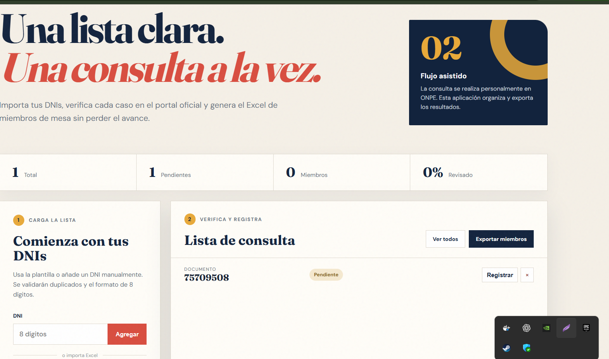

# Caso práctico 2 — Mesa Clara

Aplicación web local para organizar la verificación de miembros de mesa. Permite importar una lista de DNIs desde Excel, abrir la consulta oficial de ONPE, registrar el resultado y exportar un Excel únicamente con los miembros confirmados y su ubicación electoral.

> La web oficial no ofrece una API pública de consulta masiva. La aplicación usa un flujo asistido: el usuario realiza cada consulta en ONPE y registra el resultado. No automatiza CAPTCHA, no hace scraping y no envía DNIs a servicios externos.

## Evidencia de funcionamiento



## Funciones

- Importación `.xlsx` con validación de DNI de 8 dígitos y detección de duplicados.
- Registro de región, provincia, distrito y dirección del local de votación.
- Estados pendiente, miembro de mesa y no miembro.
- Persistencia local con SQLite en un volumen Docker.
- Exportación Excel filtrada a miembros de mesa confirmados.
- Plantilla Excel descargable y diseño adaptable a móvil.
- Endpoint de salud y pruebas automáticas.
- Tres variantes de imagen: básica, optimizada y multietapa.

## Ejecutar con Docker

Desde la carpeta `caso2`:

```bash
docker build -f Dockerfile.optimizado -t mesa-clara:caso2 .
docker run --name mesa-clara-caso2 -p 5080:5000 -v mesa-clara-data:/app/data mesa-clara:caso2
```

Abre [http://localhost:5080](http://localhost:5080). Para detener y volver a iniciar:

```bash
docker stop mesa-clara-caso2
docker start mesa-clara-caso2
```

Los datos sobreviven al reinicio porque se guardan en el volumen `mesa-clara-data`.

## Otras variantes

```bash
docker build -f Dockerfile -t mesa-clara:base .
docker build -f Dockerfile.multistage -t mesa-clara:multistage .
```

## Ejecutar pruebas

```bash
python -m pip install -r requirements-dev.txt
pytest -q
```

## Flujo de uso

1. Descarga la plantilla o agrega un DNI manualmente.
2. Importa el Excel.
3. En cada registro selecciona **Registrar** y abre el portal oficial de ONPE.
4. Copia el resultado. Si es miembro de mesa, completa región, provincia, distrito y dirección.
5. Selecciona **Exportar miembros** para obtener el consolidado.

Consulta oficial: <https://consultaelectoral.onpe.gob.pe/>

Repositorio: <https://github.com/luisdionicio-lgtm/LAB04_DOCKER>

## Privacidad y alcance

- Usa datos reales solamente en tu entorno local y elimina el volumen cuando ya no los necesites.
- No publiques la base `data/consultas.db` ni archivos con DNIs.
- El resultado válido es el mostrado por ONPE. Esta aplicación funciona como organizador local y no sustituye al portal oficial.
